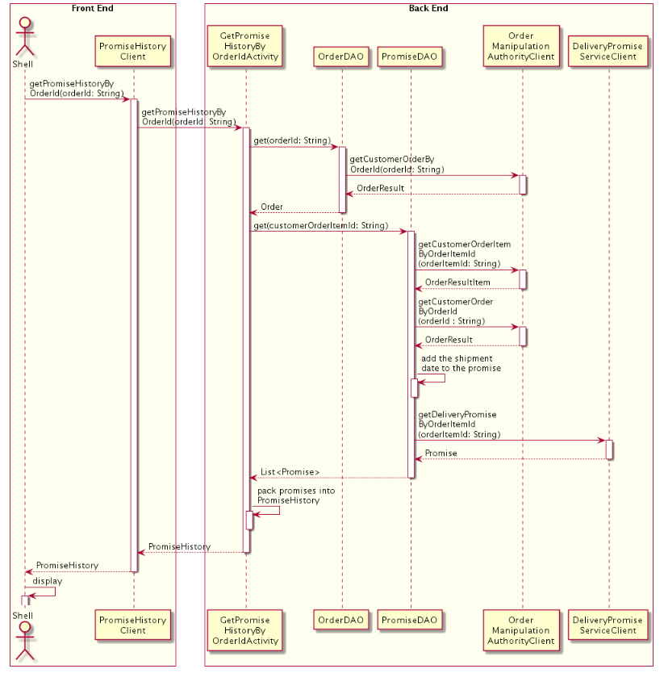
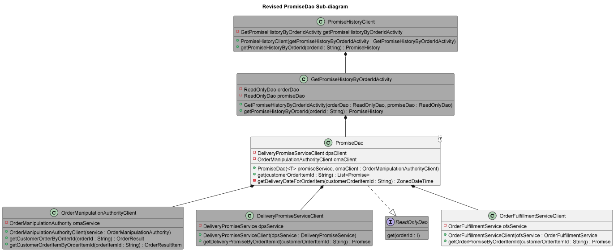

# PromiseDao Design Review

## Overview

What's the problem with the way the PromiseDao currently works?

- The PromiseDao only supports one source for promises: the Delivery Promise Service (DPS). We already need to get promises from another service, the Order Fulfillment Service (OFS), so this is a good time to make the design more flexible. 

## Use Cases

What ways will the CS representatives use the new multiple-client PromiseDao?

- Retrieving promises using both DPS and OFS clients.

In a few sentences, how does the PromiseDao work right now?

- PromiseDao is a data access object that takes in a DPSclient and OMAclient in the constructor. The get() method uses a customerOrderItemID to return a list of promises using the DPSclient object. The OMAclient object is used in a helper method to find the delivery date for the customerOrderItemId. 

Consider a developer unfamiliar with the Missed Promise CLI. Can you add diagrams here that will help them understand how the PromiseDao works right now?

- See resources/deliveringonourpromise_CD.puml and the sequence diagram:

## Proposed Solution

Describe in a few sentences how your changes will satisfy the use cases you listed above. How will you enable getting promises from OFS? How will you allow new promise sources to be added easily in the future?

- Modifying the constructor using generics for the first parameter will allow using different types of promise sources. 

## Out of Scope

Consider a reviewer who misunderstands this design and believes you're going to make the PromiseDao perfect. What are you not going to do? 

- 

## Details

Include a UML diagram that will help clarify the changes you want to make.
You can leave out classes that don't participate in the new solution, but you should leave in anything that uses your updates. For instance, even if you don't change the `GetPromiseHistoryByOrderIdActivity`, it's going to use the `PromiseDao` that you changed, so you should leave it in. Also make sure to include a link to the PlantUML source. Pro Tip: you can change a class's [color](http://plantuml.com/color) by adding “#colorname” after its name! (For example, #lightgrey visually indicates that although a class is involved, it's not a major discussion point right now).

In detail, what calls will the software make, and how will it process the results? You may use a single narrative, but it should satisfy all of the use cases you described above.

- This will be very similar to DPSclient, however Promise history depends on the order having a ship date.
- resources/RevisedPromisedDao.puml

- 
What do you expect the complexity (BigO) of this solution to be, and why? Clearly define the variable(s) you're using in your BigO notation.

- PromiseDao is O(1). The get() method returns a list of Promises for a single item. The item will only have a DeliveryPromise or OrderPromise so it will not grow linearly.  

## Potential Issues

What could go wrong with your solution? What would surprise a customer service rep who was trying to perform one of the use cases? If you can't think of anything, remove this section.

- 
